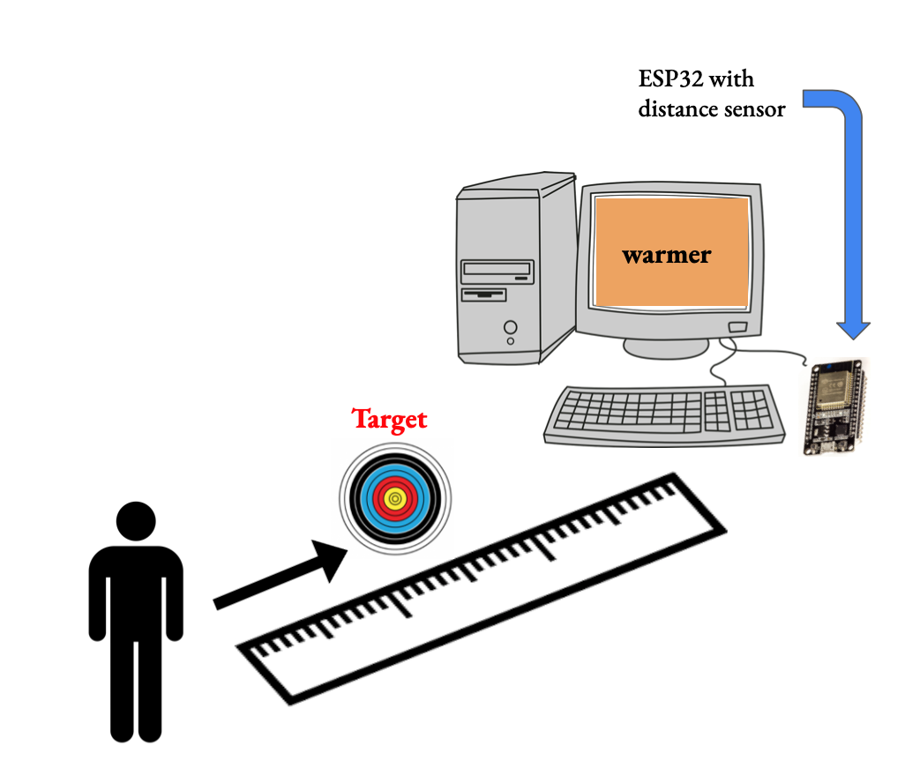

<h1>Final Project: Hot and Cold</h1>

The goal of my design is to display a heat map on a computer that’s colors reflect if a user is getting closer to (“hotter ”) or further from (“colder”) the pre-determined target distance. I will pair my ESP32 to a distance sensor to achieve this and display the color gradient on my computer to give the game participant context clues if they are getting closer or further away from their target.

The above diagram provides context to the set-up of my system. On the computer, a visual interface provides a color representation of how far away the game participant is from the target distance. The computer is connected via USB-C to the ESP32 device. The ESP32 is connected via wires to the distance sensor. As the game participant approaches or walks further away from the target distance, the gradient and label “warmer” changes. 

This repository stores all code used to implement this project.
