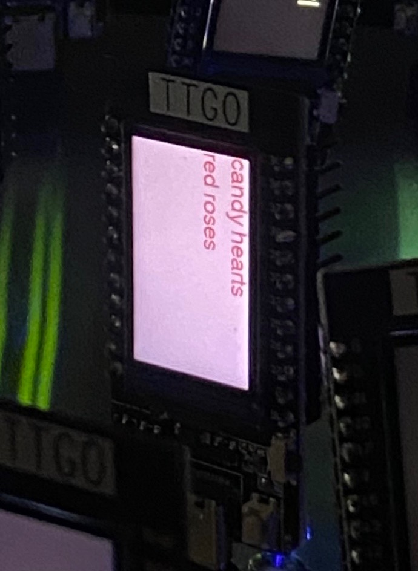
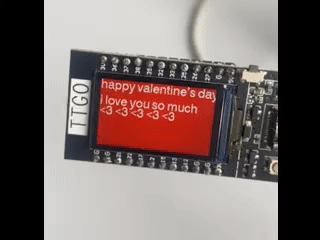

<b>Generative Art Installation: My Experience</b>

This classroom installation was originally scheduled for February 14, 2023 on Valentine's Day. My creative vision was motivated by designing generative art that would represent the holiday in some form, of conveying a message of love and affection that is especially emphasized on this holiday. 

In approaching my Valentine's Day centered design, I brainstormed what images, colors, and messages best encapsulated the holiday. I settled on the traditional pink, white, purple, and red hues, and warm, heartwarming messages. My design was in part inspired by the Sweethearts candies that say brief messages on hearts, as well as popular Valentine's day card prompts and expressions of love. 

In turn, the text I rotated between in my design is as follows:
"happy valentine's day. i love you so much <3 <3 <3 <3"

"sending love letter. you're my world. xoxoxoxo"

"kisses to you. you're my world. xoxoxoxo"

"cupid xoxo <3 <3 <3 heart eyes"

"candy hearts red roses"

To enhance the artistry of the display of these messages, I implemented the code such that the colors of both the text and the background would shift between the pre-selected white, purple, pink, and red hues. I felt the variety of colors in the rotation of messages displayed would enhance the liveliness of the design and further emphasize the Valentine's Day theme. 

I implemented the switches from message to message the same way such that the text would be displayed roughly in the same position and size in each message and that each message would be displayed for the same amount of time. I also had this rotation of messages in a cycle so that the ESP32 displays ceaselessly repeats the transition from message to message. This rotation of the messages occurs in the loop() portion of the Arduino code that can be viewed in totality in the "RLE_Font_test_valentines.ino" file in this Module 1 directory.

On the whole, there were no large technical difficulties with carrying out the artistic vision I had for the ESP32. A small issue that arose was making the text small enough so that the longer message sequences like "Happy Valentine's Day" fit on one line, as well as setting separate lines of texts far enough away from one another in the vertical dimension such that they would not overlap. This took some trial and error but was successfully achieved. 
