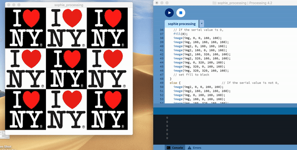

<b>Module 2: Interactive Devices</b>

This module intends to create an interactive device with the provided hardware. The devices will run off wired power and send data back to your laptop for visualization, sonfication, or whatever media generation process you prefer.

In this module, I connected a button to the ESP32 with wiring using a breadboard to connect all components. I then created an enclosure for the device to hide the hardware details. I wrote an ESP32 program that collects sensor data from the button attached to the breadboard and sends it over a serial connection to my laptop. I then wrote a media generation program on my laptop to handle this data.

I initially set out to use a Joystick to collect the sensor data. Unfortunately, I discovered that my Joystick was malfunctioning and I was unable to gather sensor data from it. I had many issues finding which ports for the X, Y, and Z values would function, which I initially thought was the issue rather than the Joystick itself. Therefore, I decided to use a button to collect sensor data. I attached the button to the breadboard directly and connected two wires to the insertion points near it from Ground and the Z port on the ESP32.

The first challenge of this module was to code the Arduino file that would print out 0 or 1 depending on the button presses. As mentioned, I had many issues with my wires and had to switch which ports they were connected to. I had to change the direction of the ESP32 on the breadboard in order for my code to run successfully. The end-result of this code, which can be seen in the file titled "xxxxxxxx." The default value of the z_value corresponding to the button was 0. That value became 1 once clicked and 0 once clicked again. 

Next, I coded the creative portion of my design.This necessitated downloading Processing and making that serial connection with the output of the xxxxxxxx value. 

